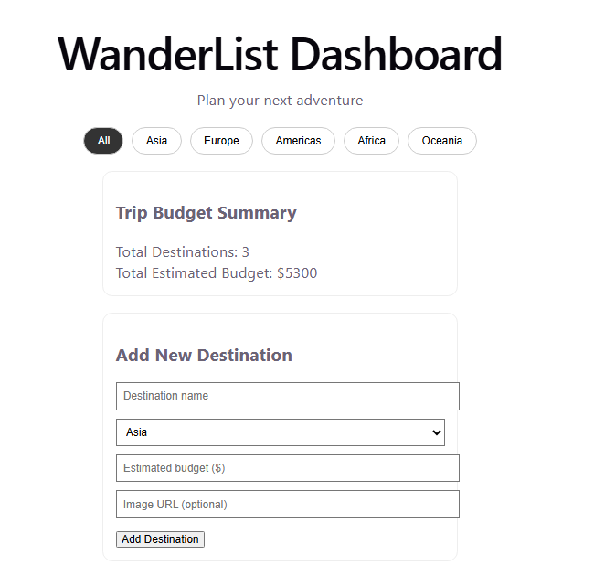
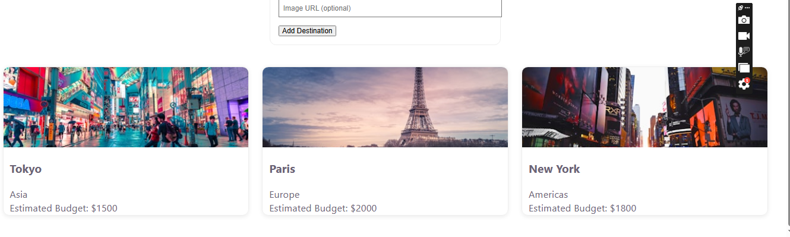
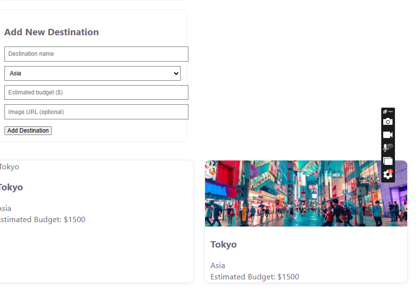

# WanderList Dashboard

A complete travel planning dashboard built with React, allowing users to browse destinations, add new ones, filter by region, and track estimated trip budgets.

## Features

- **Destination Management** – View destinations and add new ones through a form
- **Region Filtering** – Filter destinations by Asia, Europe, Americas, Africa, and Oceania
- **Trip Budget Widget** – Automatically calculates total destinations and estimated budget
- **Responsive Design** – Works smoothly across desktop and mobile devices

## Tech Stack

- React (useState Hook for state management)
- Vite
- CSS3

## Screenshots

### Dashboard View

### Add New Destination

 Open `http://localhost:5173` in your browser

## Project Structure
src/
components/
AppHeader.jsx
RegionFilter.jsx
DestinationCard.jsx
DestinationGrid.jsx
AddDestinationForm.jsx
BudgetWidget.jsx
App.jsx
App.css
main.jsx